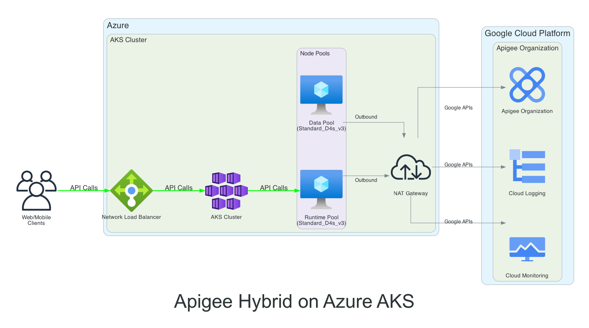
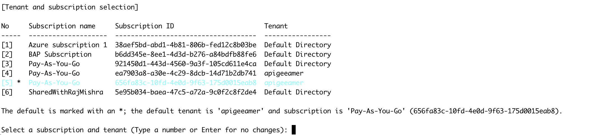

## Disclaimer
This tool is open-source software. It is not an officially supported Google product. It is not a part of Apigee, or any other officially supported Google Product.

## Architecture

The following diagram illustrates the architecture of Apigee Hybrid on Azure AKS:



The architecture consists of:

1. **Client Layer**:
   - Web/Mobile clients making API calls to the AKS cluster

2. **Azure Infrastructure**:
   - Network Load Balancer for distributing incoming traffic
   - AKS Cluster with:
     - Runtime Pool for Apigee runtime components
     - Data Pool for Apigee data components
   - NAT Gateway for outbound connectivity

3. **Google Cloud Platform**:
   - Apigee Organization for API management
   - Cloud Logging for log collection
   - Cloud Monitoring for metrics and observability


## How to Setup Apigee hybrid on Azure AKS Clusters using Terraform

The Terraform configuration defines a new Virtual Network (VNet) in which to provision the Azure Kubernetes Service (AKS) cluster. It uses the `azurerm` provider to create the required Azure resources, including the AKS cluster, node pools (with auto-scaling capabilities), Network Security Groups (NSGs), and necessary Azure RBAC configurations (e.g., using Managed Identities or Service Principals).

Open the `main.tf` file to review the resource configuration. The `azurerm_kubernetes_cluster` resource configures the cluster, including a default system node pool. Additional user node pools can be defined using `azurerm_kubernetes_cluster_node_pool` resources, for example, to have different VM sizes or capabilities for specific workloads (like Apigee runtime components).

Once the terraform provisions the aks infrastructure, it proceeds to create Apigee Organization, Environment and Environment Group and installs Apigee Hybrid.


## Getting Started

1.  **Setup an Azure Account/Subscription** if you don't have one. You can start with a free account [here](https://azure.microsoft.com/en-us/free/).
2.  **Create an Azure Service Principal or use your User Account**:
    *   For automation and CI/CD, it's recommended to create a Service Principal with the necessary permissions (e.g., "Contributor" on the subscription or a specific resource group). Follow instructions [here](https://learn.microsoft.com/en-us/azure/developer/terraform/authenticate-to-azure?tabs=bash#create-a-service-principal).
    *   Alternatively, you can authenticate as a user via Azure CLI.
    

3.  **Download and install Terraform** to your local terminal as described [here](https://developer.hashicorp.com/terraform/install).
4.  **Download and install the Azure CLI (az)** to your local terminal from where Terraform would be run, as described [here](https://learn.microsoft.com/en-us/cli/azure/install-azure-cli).
5.  **Download and install Helm** (version 3.10+ recommended, check Apigee docs for specific version compatibility).
6.  Run `terraform init` to initialize Terraform and download necessary providers.

## Pre-Cluster Setup Steps

1.  **Authenticate with Azure**:
    *   **Interactive Login (User Account)**: Run `az login`. This command will open a browser for authentication. The Azure CLI will then store your credentials locally.
    *   **Service Principal**: If you created a Service Principal, ensure your environment variables are set for Terraform to authenticate, or configure them in the Azure provider block:
        ```bash
        export ARM_CLIENT_ID="your-sp-app-id"
        export ARM_CLIENT_SECRET="your-sp-password"
        export ARM_SUBSCRIPTION_ID="your-subscription-id"
        export ARM_TENANT_ID="your-tenant-id"
        ```
2. **Authenticate with GCP**:
    *   Ensure you have the Google Cloud SDK (gcloud) installed and configured.
    *   Ensure that Organization Policy is not disabled to create service account and associated Service Account Key.
    *   Ensure that the user performing terraform has the permissions to access Google Cloud resources. While not recommended but roles like `roles/editor` or `roles/owner` should ensure all tasks completes successfully.
    *   Follow the instructions in the Apigee Hybrid documentation to authenticate with GCP using `gcloud auth application-default login` and set the `GOOGLE_APPLICATION_CREDENTIALS` environment variable.
    *   Set the `gcloud config set project <your-gcp-project-id>`

3.  **Customize the Terraform configuration files**:
    *   Review `main.tf` (and any module files) to adjust Azure resource definitions like VNet address spaces, AKS cluster version, node pool configurations (VM sizes, count, taints, labels for Apigee workloads).
    *   Update `variables.tf` and your `terraform.tfvars` file (or create one, e.g., `terraform.tfvars`) with your specific values (e.g., Azure region, resource group name, desired cluster name, node counts, VM SKUs).
    *   Ensure your Terraform configuration outputs key values like `resource_group_name` and `aks_cluster_name` which will be used later.

4.  **Run `terraform plan`**:
    Validate the list of Azure resources to be created. The exact count will vary based on your configuration. Review the plan carefully to ensure it matches your expectations.

5.  **Run `terraform apply`**:
    This will provision the Azure resources and create the AKS cluster. Confirm the apply when prompted. This process can take several minutes.

## What Happens During Terraform Apply

When you run `terraform apply`, the following resources are created in sequence:

1. **Azure Infrastructure Setup**:
   - Creates a new Resource Group with a random suffix
   - Sets up a Virtual Network (VNet) with address space 10.0.0.0/16
   - Creates a subnet for AKS nodes (10.0.1.0/24)
   - Provisions a NAT Gateway with a public IP for outbound connectivity
   - Associates the NAT Gateway with the AKS subnet

2. **AKS Cluster Creation**:
   - Creates the main AKS cluster with a system node pool
   - Configures network plugin and policy as "azure"
   - Sets up service CIDR (10.1.0.0/16) and DNS service IP (10.1.0.10)
   - Enables system-assigned managed identity

3. **Additional Node Pools**:
   - Creates "apigeerun" node pool for Apigee runtime components
   - Creates "apigeedata" node pool for Apigee data components
   - Both pools support auto-scaling if enabled
   - Configures appropriate VM sizes and disk sizes for each workload

4. **GCP/Apigee Setup** (if enabled):
   - Enables required Google Cloud APIs
   - Creates a service account for Apigee with necessary IAM roles
   - Generates and saves service account key
   - Creates self-signed TLS certificates for Apigee environment group
   - Generates Apigee overrides.yaml configuration file from the privided template file with mapped variables.
   - Sets up Apigee organization, environment, and environment group
   - Creates a directory output/${PROJECT_ID} to store generated certificates, keys , overrides.yaml and apigee-service.yaml.

5. **Final Configuration**:
   - Configures kubectl to connect to the new AKS cluster
   - Installs Apigee Hybrid (using Helm) by calling setup_apigee.sh script. The scripts unbundles all helm charts in output/${PROJECT_ID}.
   - Outputs important information like resource group name and kubeconfig

The entire process typically takes 15-30 minutes to complete, depending on the size of your cluster and the number of resources being created.


## Accessing the Cluster

Once the cluster is up, run the following command to configure `kubectl` to connect to your new AKS cluster. Ensure your Terraform configuration outputs `resource_group_name` and `aks_cluster_name`.

```bash
az aks get-credentials --resource-group $(terraform output -raw resource_group_name) --name $(terraform output -raw aks_cluster_name) --overwrite-existing
```

## Cleanup

When you're done with the Apigee hybrid setup and want to remove all created resources, follow these steps:

1. **Remove Apigee Hybrid Components**:
   ```bash
   # Delete Apigee hybrid components from the cluster
   helm uninstall <<apigee-hybrid-components>> -n apigee
   ```

2. **Destroy Terraform Resources**:
   ```bash
   # Remove all Azure resources created by Terraform
   terraform destroy
   ```
   This will remove:
   - The AKS cluster and all node pools
   - Virtual Network and subnets
   - NAT Gateway and associated resources
   - Resource Group
   - All other Azure resources created by the Terraform configuration

3. **Clean Up Local Files**:
   ```bash
   # Remove generated certificates and keys
   rm -rf output/${PROJECT_ID}/
   
   # Remove Terraform state files
   rm -f terraform.tfstate*
   ```

4. **Optional: Remove GCP Resources**:
   
   Terraform destroy should clean this up but in case of failure, you can 
   delete the GCP resources individually

   If you created GCP resources (like Apigee organization, environment, etc.), you may want to remove them as well:
   ```bash
   # Delete Apigee environment group
   gcloud apigee envgroups delete ${ENVGROUP_NAME} --organization=${PROJECT_ID}
   
   # Delete Apigee environment
   gcloud apigee environments delete ${ENV_NAME} --organization=${PROJECT_ID}
   
   # Delete Apigee organization (if created)
   gcloud apigee organizations delete ${PROJECT_ID}
   ```

Note: The `terraform destroy` command will prompt for confirmation before proceeding. Make sure you have backups of any important data before running the cleanup commands.


# Miscellaneous

## Apigee Hybrid Setup Script

The `setup_apigee.sh` script automates the installation and configuration of Apigee Hybrid on Azure AKS. It handles the deployment of all necessary components including the operator, datastore, telemetry, and ingress configurations.

### Prerequisites

Before running the script, ensure you have:

1. Access to a running AKS cluster
2. Required files:
   - `overrides.yaml`: Apigee configuration overrides
   - `service.yaml`: Service template configuration
   - Service account key JSON file
   - TLS certificate and private key for environment group
3. Required tools:
   - `kubectl` configured to access your AKS cluster
   - `helm` (version 3.10+)
   - `gcloud` CLI configured with appropriate permissions

### Script Parameters

The script accepts the following parameters:

| Parameter | Short | Required | Default | Description |
|-----------|-------|----------|---------|-------------|
| `--version` | `-v` | No | 1.14.2-hotfix.1 | Apigee version to install |
| `--namespace` | `-n` | No | apigee | Kubernetes namespace for Apigee components |
| `--overrides` | `-o` | Yes | - | Path to overrides.yaml file |
| `--service` | `-s` | Yes | - | Path to service template file |
| `--key` | `-k` | Yes | - | Path to service account key JSON file |
| `--cert` | `-c` | Yes | - | Path to environment group certificate file |
| `--private-key` | `-p` | Yes | - | Path to environment group private key file |
| `--help` | `-h` | No | - | Display help message |

### Sample Usage

1. **Basic Usage with Required Parameters**:
   ```bash
   ./setup_apigee.sh \
     --overrides "/path/to/overrides.yaml" \
     --service "/path/to/service.yaml" \
     --key "/path/to/sa-key.json" \
     --cert "/path/to/cert.pem" \
     --private-key "/path/to/key.pem"
   ```

2. **Custom Version and Namespace**:
   ```bash
   ./setup_apigee.sh \
     --version "1.14.2-hotfix.1" \
     --namespace "apigee-prod" \
     --overrides "/path/to/overrides.yaml" \
     --service "/path/to/service.yaml" \
     --key "/path/to/sa-key.json" \
     --cert "/path/to/cert.pem" \
     --private-key "/path/to/key.pem"
   ```

3. **Using Short Options**:
   ```bash
   ./setup_apigee.sh \
     -v "1.14.2-hotfix.1" \
     -n "apigee" \
     -o "/path/to/overrides.yaml" \
     -s "/path/to/service.yaml" \
     -k "/path/to/sa-key.json" \
     -c "/path/to/cert.pem" \
     -p "/path/to/key.pem"
   ```

### What the Script Does

1. **Setup Phase**:
   - Creates necessary directories
   - Pulls required Helm charts
   - Copies configuration files to appropriate locations

2. **Installation Phase**:
   - Creates Kubernetes namespace
   - Enables control plane access
   - Installs CRDs
   - Installs cert-manager
   - Installs Apigee operator
   - Installs datastore
   - Installs telemetry
   - Installs Redis
   - Installs ingress manager
   - Installs organization
   - Installs environment
   - Installs environment group
   - Sets up ingress

### Troubleshooting

If you encounter issues:

1. **Check Prerequisites**:
   ```bash
   # Verify kubectl access
   kubectl cluster-info
   
   # Verify helm version
   helm version
   
   # Verify gcloud configuration
   gcloud config list
   ```

2. **Check Logs**:
   ```bash
   # Check operator logs
   kubectl logs -n apigee -l app=apigee-controller
   
   # Check datastore logs
   kubectl logs -n apigee -l app=apigee-datastore
   ```

3. **Verify Installation**:
   ```bash
   # Check all pods
   kubectl get pods -n apigee
   
   # Check services
   kubectl get services -n apigee
   ```